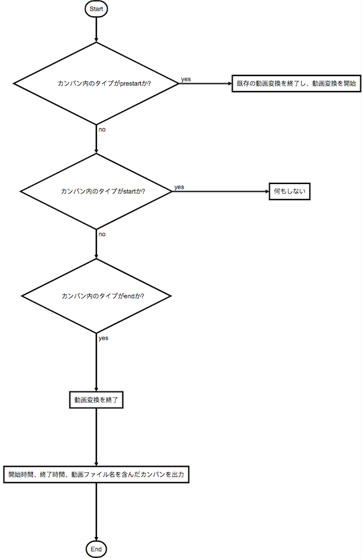

# Capture-Movie-From-RTSP-Daemon
## Description  
RTSPでストリーミング配信されている映像を動画ファイルに変換するマイクロサービスです。   
kanbanから開始の指示を受けたら動画の変換を開始し、終了の指示を受け取ったら動画の変換を終了します。

## Requirement  
ストリーミング配信をしているサービスが、同一Kubernetesクラスター内、あるいはネットワーク内に存在する必要があります。

## I/O
kanbanのメタデータから下記の情報を入出力します。
### Input
| タイプ(type)  |  |
| --- | --- | 
| 1. prestart| 仮で動画変換を開始する。   
| 2. start| 動画変換の開始を確定する。   
| 3. end | 動画変換を終了する。

### Output  
| 変数名 |  |
| --- | --- |
| start_time | 動画変換を開始した時間 |   
| end_time | 動画変換を終了した時間 | 
| file_name  | 動画ファイル名 | 

## Getting Started
1. 下記コマンドでDockerイメージを作成する。  
```
make docker-build
```
2. Project.ymlに設定を記載し、AionCore経由でコンテナを起動する。  
project.ymlへの記載例  
    * get_kanban_itrのメソッドで動作するので、multiple: noとして起動する。  
    * 動画を送信したい端末名をNEXT_DEVICEに記載する。　　
```
  capture-movie-from-rtsp:
    multiple: no
    privileged: yes
    env:
      NEXT_DEVICE:  ###
```
## Flowchart
